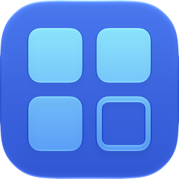
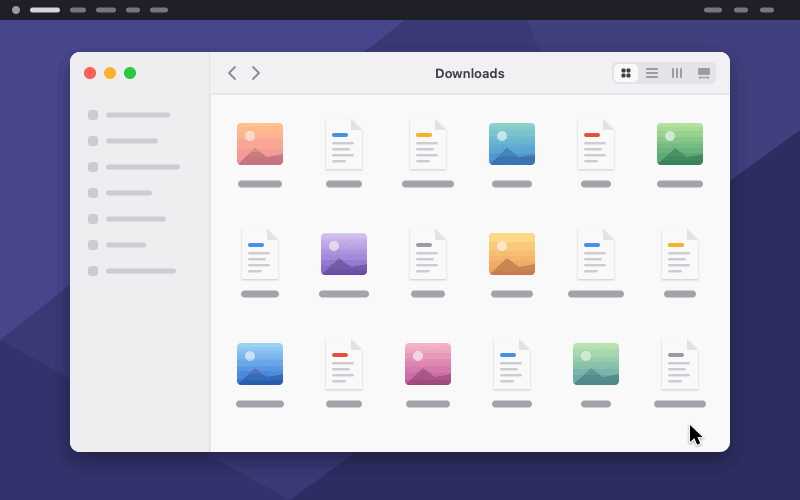

<p align="center">
  
</p>

<h1 align="center">ShiftPick</h1>

<p align="center">
  <strong>Shift-click a range of files in Finder's icon view, the way every other list on your Mac
  already works.</strong><br>
  Click one file, hold ⇧ Shift, click another: everything between them is selected. Finder does this in
  list, column and gallery views. ShiftPick is the one thing that makes it work in icon view and on the
  Desktop, and it does nothing else at all.
</p>

<p align="center">
  
  
  
  
  
  
</p>

## The problem

Every list on a Mac selects a range with ⇧ Shift. Finder's list view does. Its column view does. Its
gallery view does. **Its icon view does not**: there, ⇧ Shift adds the one file you clicked, and taking
forty files out of a folder of sixty means dragging a rectangle around them and hoping you did not clip the
edge, or holding ⌘ Command and clicking forty times.

The Desktop is icon view too, so it has the same gap.

## Click one, ⇧ Shift click another

<p align="center">
  
</p>

That is the whole of it. The animation is an illustration, drawn to the app's own rules: the reading order,
what a ⇧ Shift click leaves selected and the first file every range is measured from are the real ones. The
window is schematic.

## What it does

| You do | What happens |
|---|---|
| Click a file | Nothing changes. That file is where the next range will be measured from. |
| ⇧ Shift click another file | Everything between the two is selected. |
| ⇧ Shift click again, somewhere else | A new range, measured from the **same** first file, so you can widen and narrow it without starting over. |
| ⌘ Command click, then ⇧ Shift click | The earlier selection stays; the range runs from the ⌘ Command clicked file, exactly as in a list view. |
| ⌘ Command ⇧ Shift | Finder's own: the one file is toggled. |
| Anything else | Finder gets the click exactly as it always did. |

It works in **every Finder icon view**: folders, search results, Recents, tags, iCloud Drive, and the
Desktop. In every Sort By mode, with or without **Use Groups**, with or without **Stacks**, and in a folder
nobody has sorted at all. It works in **Open and Save panels shown as icons** too, whichever app put them
up: measured, those have exactly the same gap. There is no setting that says where it works, because there
is no place it does not.

- **Between** means what you would expect it to mean. In a sorted view it is the reading order: across the
  row, down to the next, on to the end of the group and into the next one. On a sorted Desktop it is down
  the column and on to the column at its left, which is the order the Desktop fills. In a folder whose icons
  somebody put where they wanted them, the grids they made are worked out from where the icons sit and read
  along their rows; where no one grid holds both icons, it is the rectangle drawn between the two, as if you
  had dragged one.
- **What is left selected is what a list view would leave.** A ⇧ Shift click replaces the runs of selected
  files it reaches, whole, and leaves every other one alone, so a range you built with ⌘ Command clicks
  survives the next ⇧ Shift click. That is AppKit's own rule, measured rather than guessed at.
- **A stack is never selected.** A collapsed stack on the Desktop is not a file, so it is never in a range,
  and ⇧ Shift clicking one is left to Finder.
- **It never gets in the way.** With no finger on ⇧ Shift, no click on your Mac passes through ShiftPick at
  all. A ⇧ Shift click on anything that is not a file in an icon view, during a rename, or with ⌥ Option or
  ⌃ Control held, goes straight to Finder. So does one ShiftPick cannot answer within 150 ms. **Whatever goes
  wrong, clicking still works**: take its permission away, force it to quit, put the Mac to sleep under it,
  and the worst that happens is a ⇧ Shift click that does what Finder always did.

## Settings

A four-page window, opened from the menu-bar item (⌘,) or by opening the app again, which is the way in
when the icon is hidden. Every change applies as you make it. **Nothing in it is a setting about what
ShiftPick does**: the feature is always on and does one thing one way.

| Page | What is on it |
|---|---|
| **General** | Launch at login · Show in menu bar · Updates · Quit · Uninstall |
| **System** | the Accessibility permission, live, with the way to grant it · whether ShiftPick is listening for ⇧ Shift clicks, and the button that starts it listening again if macOS kept interrupting it · the way back to the welcome wizard |
| **Health** | whether ShiftPick works, at a glance, in two tables. *Health*: the permission, whether it is watching for ⇧ Shift clicks, and, only while something is wrong, Finder and this week's crashes, each green, orange or red with what to do about it · Check Again. *Information*: how long it has run, its memory |
| **Tip** | everything is free and stays free · a one-time tip on Ko-fi |

The menu-bar item carries Launch at Login, one line saying what the app is doing right now, Settings and
Quit.

ShiftPick speaks **English and French**, following the language your Mac is set to.

## Install

Download the disk image from
[the latest release](https://github.com/bambidotexe/shiftpick/releases/latest), open it and drag
**ShiftPick** to Applications, then open it once. It is signed with a Developer ID and notarized by Apple,
so it opens without a warning.

The first launch opens a short welcome wizard: what the app does, then the one permission it needs, then
where it lives. **Accessibility** is that permission, and the wizard's own Allow button is the only thing
that ever asks for it. Grant it and the app starts working at once, with no relaunch. macOS 27 lists it in
System Settings › Privacy & Security under *Device Control and Data Access*.

Settings › System › Start over opens the wizard again.

From this repository instead:

```sh
make install
```

That builds the same signed, notarized bundle, puts it in `/Applications` and opens it, leaving no `.app`
and no `.dmg` anywhere under the repository.

ShiftPick keeps itself up to date. It looks for a newer version when it starts and once a week, and tells
you with a notification. Click **Update**, there or in Settings › General, and a small window fetches it;
**Install and Relaunch** then swaps the app and reopens it, and says so when it is back. Nothing is fetched
or installed without a click.

**Settings › General › Uninstall** is how it comes off: it gives back the Accessibility permission, removes
the Login Items entry, removes its settings and its update folder, moves itself to the Trash and quits.
Dragging it to the Trash yourself leaves the first two behind, pointing at an app that is gone.

## Build from source

```sh
swift build         # three targets and the Accessibility probe
swift test          # two bundles; read both summary lines
make app            # assembles build/ShiftPick.app
make install        # the real thing, into /Applications
```

It is a SwiftPM package with no Xcode project and no third-party dependency. `make app` wants full Xcode for
the `actool` that compiles the app icon; with the Command Line Tools alone it still builds, warns, and ships
the flat icon without Liquid Glass.

`swift run axdump` is the development probe. It reads Finder's Accessibility hierarchy, which is where
everything ShiftPick knows about icon views came from, and `swift run axdump range <x> <y>` works out what a
⇧ Shift click at a point would select and prints it instead of doing it.

## Requirements

- **macOS 26 or later**, and a Swift toolchain to build it.
- **One permission: Accessibility.** It is what lets ShiftPick see which file is under the pointer and tell
  Finder what to select. No Automation, no Input Monitoring, no Screen Recording, no Full Disk Access.
  Nothing about your files ever leaves your Mac, and the only thing the app ever sends over the network is
  its own update check.

## How it works

Two event taps. One only listens for ⇧ Shift going down and coming up, and a listener cannot hold anything
up. The other can swallow a click, and it is switched on only while ⇧ Shift is held, after asking macOS
whether ShiftPick is still allowed to. A ⇧ Shift click is then hit-tested through the Accessibility API; if
what is under the pointer is an icon in a Finder icon view, ShiftPick reads every icon's frame in that view,
works out which ones lie between the two you clicked, sets Finder's selection itself, swallows the click so
that Finder does not toggle the file on top of it, brings Finder forward and raises the window. None of that
happens on the thread that holds your click: it waits 150 ms for an answer, and then gives the click back.

Where the icons sit is the whole input. They are clustered into rows and columns, and the layout is read as
either *arranged*, which Finder is laying out and which has a reading order to slice, or *hand-placed*,
whose icons are cut into groups and each group fitted with a grid read along its rows; where no one grid
holds both ends, the rubber band answers instead. What the click then leaves selected is AppKit's own rule,
measured on `NSTableView`. That is all pure arithmetic over rectangles, so all of it is unit-tested: a
perfect grid, a partial last row, a grid with holes, a hand-tidied grid however it wobbles, two groups with a
gap between them, a scatter, a Desktop filling columns from the right, a right-to-left window, grouped
sections, one row, one column, and five thousand icons. See `docs/architecture.md` and `docs/macOS.md`.

## Limitations

- **Both ends of a range have to be on screen.** Finder only builds the icons it is showing, so a file that
  has scrolled out of view is not something ShiftPick can name. Click, scroll three screens, ⇧ Shift click,
  and the click goes to Finder untouched rather than selecting a range that quietly leaves files out.
  `docs/pitfalls.md` has the measurement and why Apple events are not the way around it.
- **A grid nobody sorted is inferred, not asked for.** A group of icons whose rows are too ragged for the
  tolerances reads as a scatter, and a range in it is the rubber band rather than a run of a row. So does a
  range whose two ends are in groups far enough apart to be two grids.
- Finder's own ⇧ Shift behaviour in list, column and gallery views is untouched: those views already do
  this, and ShiftPick never looks at them.
- In an Open or Save panel it only works where the panel allows several files at once. A panel that asks
  for one file is left alone by the panel itself.

## Documentation

| | |
|---|---|
| [CLAUDE.md](CLAUDE.md) | The operating manual for working on it: what it is, the change workflow, where each change lands, commands, rules, traps. Start here. |
| [docs/README.md](docs/README.md) | The index of the documents below. |
| [docs/functional.md](docs/functional.md) | What it does: every rule, every number. Authoritative. |
| [docs/architecture.md](docs/architecture.md) | Targets, the click path, threading, the update, the build. |
| [docs/macOS.md](docs/macOS.md) | The platform boundary, and Finder's Accessibility hierarchy as it was read. |
| [docs/pitfalls.md](docs/pitfalls.md) | Traps already fallen into, with the measurements. |
| [docs/manual-test-checklist.md](docs/manual-test-checklist.md) | What only a person can see. |

## Support

ShiftPick is free and carries no ads. If it saves you trouble, you can leave a tip on
[Ko-fi](https://ko-fi.com/bambidotexe).

## Notes

- Personal build: English and French.
- `swift test` runs 383 tests across the two library targets (345 + 38); the app target's verification is
  `docs/manual-test-checklist.md`, the log, and `swift run axdump range`.
- The app icon and the menu-bar mark are the same drawing: four icons in a grid, three of them selected
  and the fourth not. See `Resources/ICON-NOTES.md`.
